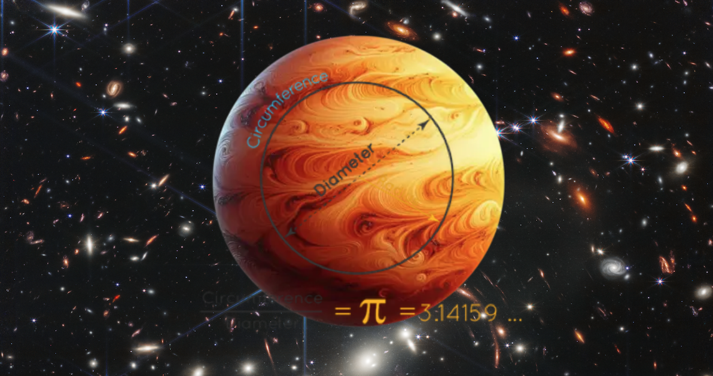
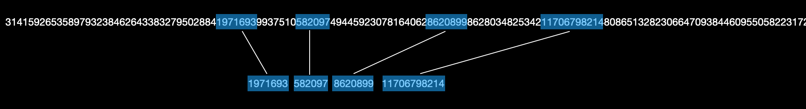
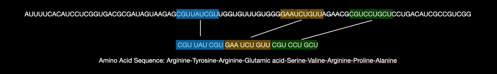
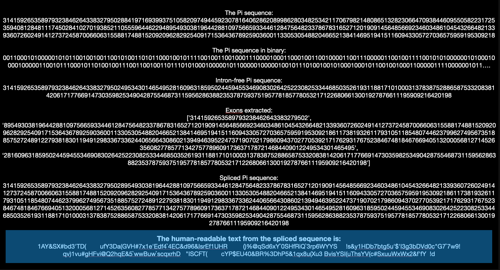
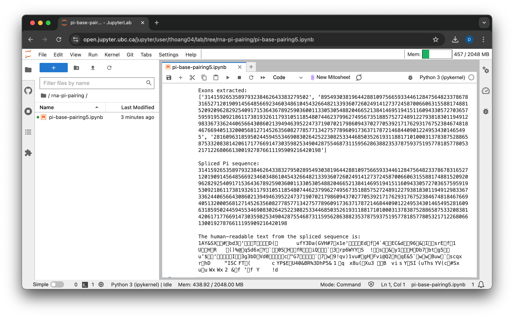
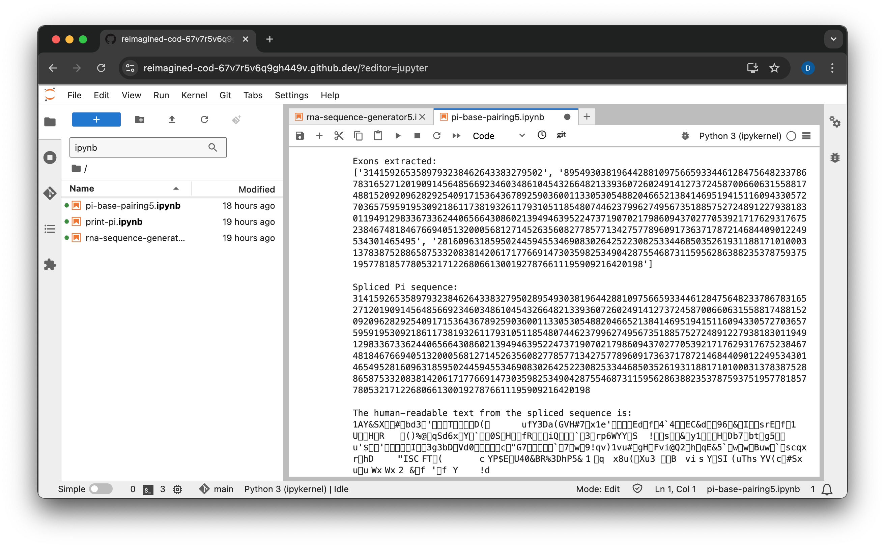
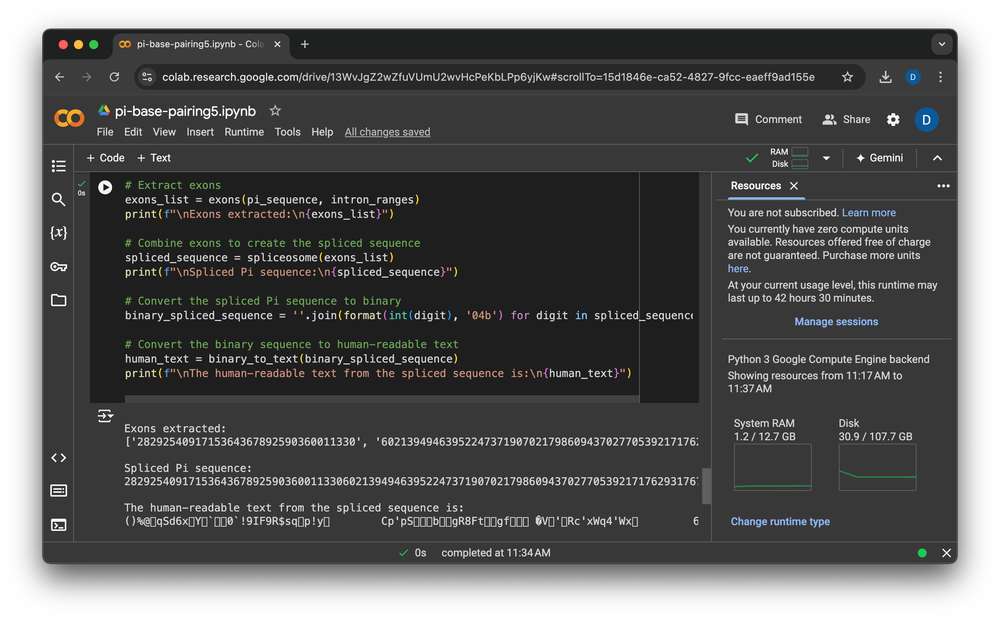

# π Signal Sequence Splicing with Machine Learning for Theoretical Exploration

- Dare to Dream
- Inspire Bold Leadership
- Embrace Diversity in Thought and Innovation
- Discover the universe together and unlock the depths of knowledge and exploration.

------------------------------

"Pi Signal Sequence Splicing" represents a pioneering fusion of mathematical precision and biological processes for interstellar communication. By integrating the infinite, non-repeating sequence of Pi (π) with the principles of DNA and RNA, this innovative methodology uses Pi as a universal language for encoding complex messages that could potentially be understood by extraterrestrial intelligence. Drawing analogies between the splicing of genetic material and the manipulation of Pi sequences, this approach introduces a novel paradigm for cosmic information transmission.

----------------------------------
The PI Sequence:

----------------------------------
The RNA Sequence:

----------------------------------

In genetics, DNA and RNA contain sequences called introns and exons. Introns are non-coding regions that do not directly contribute to the production of proteins, while exons are coding regions that contain the actual instructions for building proteins. During a process called RNA splicing, the introns are removed, and the exons are joined together to form a continuous sequence that can be translated into a protein. This splicing process is crucial for ensuring that only the relevant, active genetic information is used in the creation of proteins.

Now, if we apply this concept to the idea of using Pi (π) as a mapping tool for interstellar communication or information encoding, the digits of Pi can be thought of as analogous to a sequence containing both "introns" (irrelevant or non-message-bearing digits) and "exons" (meaningful, message-bearing digits). Just as in RNA splicing, where the introns are removed to reveal an active sequence, one could theoretically "splice" the digits of Pi by identifying and extracting specific sequences (exons) that encode a meaningful message, while disregarding the irrelevant parts (introns).

This method would involve mapping certain patterns within the infinite digits of Pi to predetermined sequences that represent intelligible messages. By identifying and "splicing" these patterns—much like the biological process of removing introns and joining exons—one could extract a coherent and active signal from within the seemingly random digits of Pi. This approach could potentially be used to communicate complex information, either as a form of interstellar message or as a unique encoding strategy within computational systems.

## Conclusion:

This concept bridges multiple disciplines, including interstellar communication strategies, the universality of mathematical constants, and the parallels between biological processes and information theory. Its distinctive approach makes it a compelling subject for further exploration and speculative research, which I am eager to pursue or collaborate on.

------------------------------------

## UBC OpenJupyter Notebooks

## Github CodeSpaces

## Google Colab Notebooks

